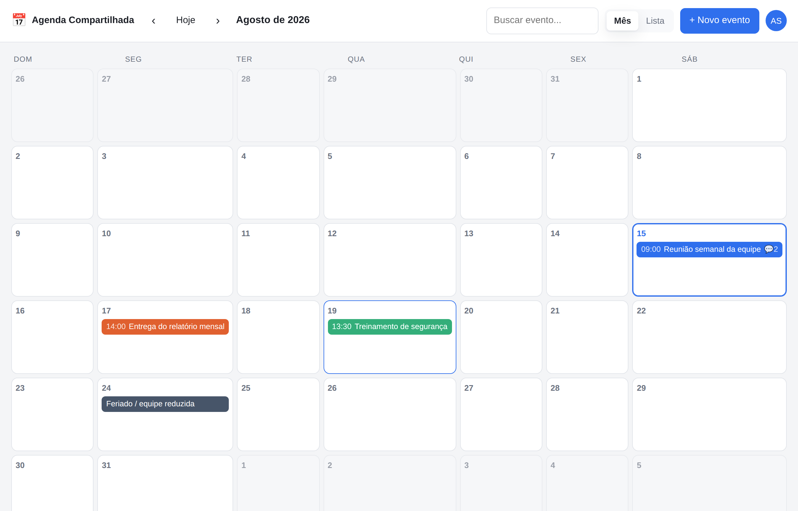

# 📅 Agenda Compartilhada

Agenda de equipe em que **todos os funcionários podem adicionar, editar e comentar** os
eventos. Feita para rodar em um servidor da empresa (ou em qualquer serviço de hospedagem
Node.js) e ser acessada pelo navegador, no computador ou no celular.



## O que ela faz

| Recurso | Detalhe |
| --- | --- |
| **Qualquer pessoa cria eventos** | Clique em um dia do calendário ou no botão **+ Novo evento**. |
| **Qualquer pessoa edita** | Todo membro da equipe pode editar qualquer evento — inclusive os criados por colegas. |
| **Comentários** | Cada evento tem uma conversa: combine detalhes, avise atrasos, anexe a pauta. Cada um edita e apaga o próprio comentário. |
| **Histórico de alterações** | Registra quem criou, quem editou (e o que mudou) e quem comentou. |
| **Visão de mês e lista** | Calendário mensal com as cores dos eventos, ou lista em ordem cronológica. |
| **Busca** | Procura por título, descrição ou local em toda a agenda. |
| **Dia inteiro e eventos de vários dias** | Feriados, viagens, mutirões. |
| **Equipe** | Lista de quem usa a agenda; administradores podem promover colegas. |
| **Acesso protegido** | Login com senha e código de convite da equipe. Tema claro/escuro automático. |

### Quem pode fazer o quê

| Ação | Membro | Administrador |
| --- | :---: | :---: |
| Criar evento | ✅ | ✅ |
| Editar **qualquer** evento | ✅ | ✅ |
| Comentar | ✅ | ✅ |
| Editar o próprio comentário | ✅ | ✅ |
| Excluir evento | apenas os que criou | qualquer um |
| Excluir comentário | apenas os próprios | qualquer um |
| Promover/rebaixar colegas | ❌ | ✅ |

> A exclusão é o único ponto mais restrito: como não dá para desfazer, ela fica com quem criou
> o evento ou com um administrador. Para liberar a exclusão para todo mundo, remova a checagem
> em `src/routes/events.js` (rota `DELETE /:id`).

## Como colocar no ar

Requisitos: **Node.js 18 ou superior**. O banco é um arquivo SQLite criado sozinho — não
precisa instalar banco de dados. Para publicar em hospedagem sem disco, o mesmo código aponta
para o Turso trocando uma variável de ambiente (veja o [DEPLOY.md](DEPLOY.md)).

```bash
git clone https://github.com/luizhenrique29619-rgb/AGENDA-COMPARTILHADA.git
cd AGENDA-COMPARTILHADA
npm install
cp .env.example .env      # ajuste a porta e o código de convite
npm start
```

Abra `http://localhost:3000`. **A primeira pessoa que se cadastrar vira administradora.**

### Configuração (`.env`)

| Variável | Para que serve |
| --- | --- |
| `PORT` | Porta do servidor (padrão `3000`). |
| `DATABASE_FILE` | Onde guardar o banco local (padrão `./data/agenda.sqlite`). |
| `TURSO_DATABASE_URL` | Banco SQLite na nuvem. Quando preenchida, tem prioridade sobre o arquivo local. |
| `TURSO_AUTH_TOKEN` | Token de acesso do banco Turso. |
| `INVITE_CODE` | Código que os colegas digitam ao criar a conta. Deixe em branco só se a agenda estiver em rede interna. |
| `SECURE_COOKIES` | Coloque `true` quando o site estiver publicado em HTTPS. |
| `SESSION_DAYS` | Quantos dias o login continua válido (padrão `30`). |

### Publicando para a equipe

O passo a passo completo está em **[DEPLOY.md](DEPLOY.md)**. Há um caminho **gratuito e sem
cartão de crédito** (Render + Turso), um pago que não dorme (Fly.io) e um para servidor
próprio (Docker). O repositório já traz `Dockerfile`, `docker-compose.yml`, `fly.toml`,
`render.yaml` e o script `deploy-fly.sh` prontos.

### Convidando a equipe

1. Publique a agenda em um endereço que a equipe alcance (veja o [DEPLOY.md](DEPLOY.md)).
2. Defina um `INVITE_CODE` e mande para os colegas junto com o link.
3. Cada pessoa clica em **Criar conta**, informa nome, e-mail de trabalho, senha e o código.
4. Pronto: todos veem a mesma agenda e as edições de um aparecem para os outros ao recarregar.

### Dados de exemplo (opcional)

```bash
npm run seed    # cria 3 pessoas e alguns eventos; login: ana@empresa.com / senha1234
```

Apague o arquivo do banco (`data/agenda.sqlite`) para começar do zero.

## Backup

Com banco local, todo o conteúdo fica em `data/agenda.sqlite` — para fazer backup basta copiar
o arquivo (com o servidor parado, ou usando `sqlite3 data/agenda.sqlite ".backup copia.sqlite"`).
Com banco no Turso, use `turso db shell agenda ".dump" > copia.sql`.

## Estrutura do projeto

```
src/
  server.js          Express: middlewares, API e arquivos estáticos
  db.js              Banco (arquivo local ou Turso) + criação das tabelas
  auth.js            Sessões em cookie httpOnly
  wrap.js            Encaminha erros de rotas assíncronas ao tratador
  routes/
    auth.js          cadastro, login, logout, troca de senha
    events.js        eventos e criação de comentários
    comments.js      edição/exclusão de comentários
    users.js         equipe e permissões
public/
  index.html         Telas de login e da agenda
  css/styles.css     Estilo (tema claro e escuro)
  js/app.js          Calendário, formulários e comentários
scripts/seed.js      Dados de demonstração
```

## API

Todas as rotas abaixo de `/api` (menos as de autenticação) exigem sessão ativa.

| Método | Rota | Descrição |
| --- | --- | --- |
| `POST` | `/api/auth/register` | Cria conta (`name`, `email`, `password`, `invite`). |
| `POST` | `/api/auth/login` | Entra na agenda. |
| `POST` | `/api/auth/logout` | Sai. |
| `POST` | `/api/auth/password` | Troca a senha. |
| `GET` | `/api/auth/me` | Usuário da sessão atual. |
| `GET` | `/api/events?from=&to=&search=` | Lista eventos do período ou da busca. |
| `POST` | `/api/events` | Cria evento. |
| `GET` | `/api/events/:id` | Evento + comentários + histórico. |
| `PUT` | `/api/events/:id` | Edita evento (qualquer membro). |
| `DELETE` | `/api/events/:id` | Exclui (criador ou administrador). |
| `POST` | `/api/events/:id/comments` | Comenta. |
| `PUT` | `/api/comments/:id` | Edita o próprio comentário. |
| `DELETE` | `/api/comments/:id` | Exclui comentário (autor ou administrador). |
| `GET` | `/api/users` | Lista a equipe. |
| `PUT` | `/api/users/:id/role` | Muda o perfil (só administradores). |

Datas trafegam em ISO 8601 (UTC) e são exibidas no fuso do navegador de cada pessoa.

## Segurança

- Senhas guardadas com `bcrypt`; sessões em cookie `httpOnly` + `SameSite=Lax`.
- Limite de 10 tentativas de login por IP a cada 15 minutos.
- Todo o conteúdo escrito pela equipe é inserido na tela como texto (sem HTML), evitando XSS.
- Consultas ao banco usam sempre parâmetros preparados.
- Em produção, sirva atrás de HTTPS e ligue `SECURE_COOKIES=true`.
